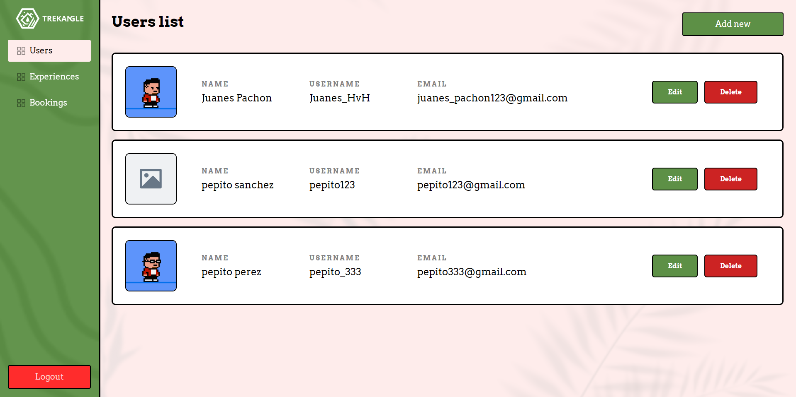
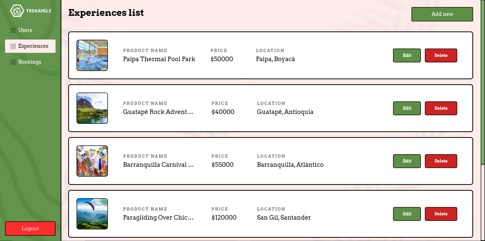
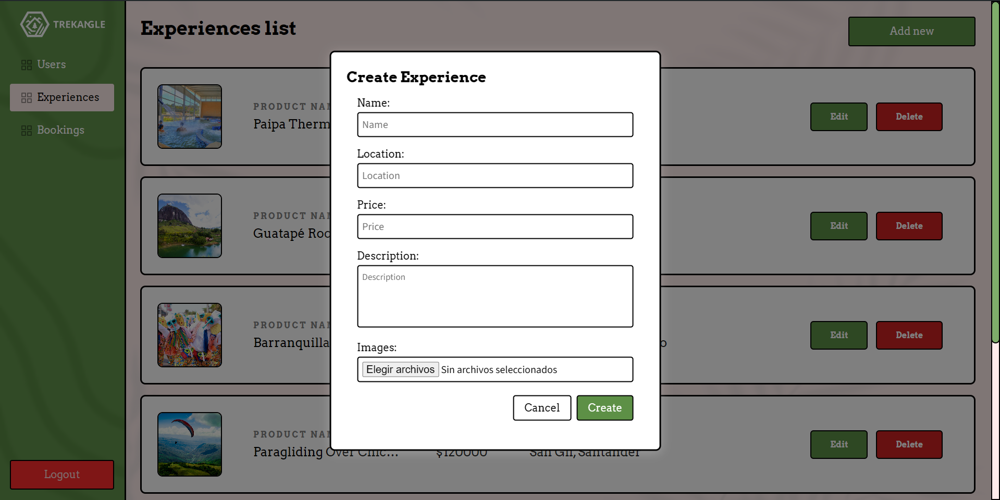

<p align="center">
  
</p>

# Trekangle Admin Dashboard
Este Dashboard de Trekangle hace parte de el Proyecto Final de el programa de Desarrollo Web en BIT, en donde se desarrolla la vista del Administrador de el E-commerce web de Trekangle.

## Características del Frontend

- Vista de todos las entidades de la aplicación.
- Creacion, edicion, y eliminacion de las entidades de la aplicación.
- Vista de la página de login de para ingresar a las características del administrador.

## 📸 Screenshots

<p align="center">
  
  
</p>
<p align="center">
  
  
</p>

## ⚙ Configuración local
```bash
# 1. Clonar el repositorio
git clone https://github.com/JuanesPachon/web-trakangle-admin-dashboard.git

# 2. Acceder a la carpeta principal del proyecto
cd web-trakangle-admin-dashboard

# 3. Instalar las dependencias utilizadas en el proyecto
npm install

# 4. Ejecutar La aplicación
ng serve --open

```


## 🧱 Estructura del Proyecto

- `/components`: Componentes Individuales de la aplicación.
- `/pages`: Páginas de la aplicación.
- `/services`: Servicios de la aplicación para la comunicación con la API.
- `/guards`: Guards de la aplicación para la autenticación y autorización.
- `/public`: Archivos estaticos de la aplicación.
  
## 🛠 Tecnologías Utilizadas

- **Angular**: Framework de desarrollo web.
- **TypeScript**: Lenguaje de programación.
